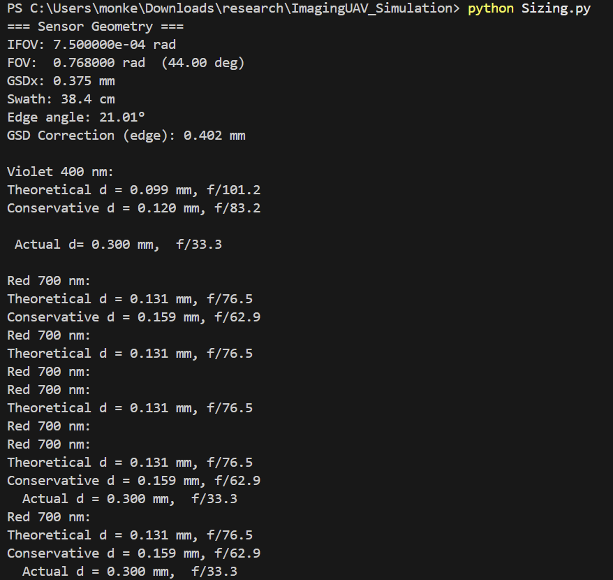

# ImagingUAV_Simulation
Dependencies: 
numpy
scipy
matplotlib

# create camera (no pipeline kwarg)

#NOTES from Sept 26th:
# 1. 50 cm away for distance 
# 2. updated pixel count on the code  
# 3. Pinhole no larger than 0.3mm and 1cm away from the sensor
# 4. Focal length 0.98 cm 
# 5. We can calculate the FOV. Raysect is vertical FOV. 

#NOTES - 09/30/25
Output from Sizing.py: 
We are using the Sizing.py document and then using those conditions for Raysect
    The values we are using for Raysect:
    Pinhole size = 0.25mm
    Pinhole distance to sensor = 1cm
    Object distance to pinhole = 50cm

